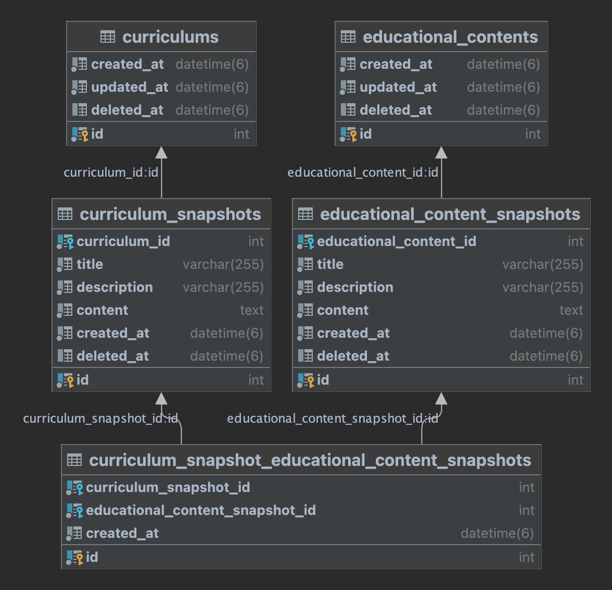

## 실행 방법

---

1. docker-compose 실행

```bash
docker-compose up -d
```

2. DB 스키마 생성 스크립트 실행

```bash
npm run migration:run
```

3. DB 시드 데이터 추가

```bash
npm run migration:seed
```

---

### DB 접속 정보

---

- 호스트: `localhost`
- 포트: `3306`
- 사용자 이름: `pung`
- 비밀번호: `pungPassword!23`
- 데이터베이스: `codestates`

---

### 데이터베이스 테이블



### `curriculums`

`curriculums` 커리큘럼은 여러 교육 콘텐츠를 묶어서 고객에게 전달하는 단위입니다.
이러한 묶음 단위를 커리큘럼이라고 합니다.

- **id**: `int` (기본 키) - 커리큘럼의 고유번호.
- **created_at**: `datetime` - 커리큘럼이 생성된 시각.
- **updated_at**: `datetime` - 커리큘럼이 마지막으로 업데이트된 시각.
- **deleted_at**: `datetime` - 커리큘럼이 삭제된 시각 (소프트 삭제).

#### 관계

- **curriculum_snapshots**: `curriculum_snapshots` 테이블과 일대다 관계.
<hr style="border: none; border-top: 1px dotted #000;">

### `curriculum_snapshots`

`curriculum_snapshots` 테이블은 커리큘럼의 버전을 나타냅니다. 커리큘럼을 수정할 때마다 원본을 수정하는 대신,
새로운 레코드를 생성하여 커리큘럼의 변경 사항을 기록합니다.
이를 통해 이전 버전의 커리큘럼을 보존하고, 각 버전의 내용을 추적할 수 있습니다.

- **id**: `int` (기본 키) - 커리큘럼 스냅샷의 고유번호.
- **curriculum_id**: `int` - 관련 커리큘럼의 고유번호.
- **title**: `varchar` - 스냅샷의 제목.
- **description**: `varchar` - 스냅샷의 설명.
- **content**: `text` - 스냅샷의 내용.
- **created_at**: `datetime` - 스냅샷이 생성된 시각.
- **deleted_at**: `datetime` - 스냅샷이 삭제된 시각 (소프트 삭제).

#### 관계

- **curriculums**: `curriculums` 테이블과 다대일 관계.
- **curriculum_snapshot_educational_content_snapshots**: `curriculum_snapshot_educational_content_snapshots` 테이블과 일대다 관계.
<hr style="border: none; border-top: 1px dotted #000;">

### `curriculum_snapshot_educational_content_snapshots`

`curriculum_snapshot_educational_content_snapshots` 테이블은 커리큘럼 스냅샷과 교육 콘텐츠 스냅샷 간의 관계를 나타냅니다.

- **id**: `int` (기본 키) - 고유번호.
- **curriculum_snapshot_id**: `int` - 관련 커리큘럼 스냅샷의 고유번호.
- **educational_content_snapshot_id**: `int` - 관련 교육 콘텐츠 스냅샷의 고유번호.
- **created_at**: `datetime` - 스냅샷이 생성된 시각.

#### 관계

- **curriculum_snapshots**: `curriculum_snapshots` 테이블과 다대일 관계.
- **educational_content_snapshots**: `educational_content_snapshots` 테이블과 다대일 관계.
<hr style="border: none; border-top: 1px dotted #000;">

### `educational_contents`

`educational_contents` 테이블은 교육 콘텐츠를 나타냅니다.
각 교육 콘텐츠는 지식의 최소 전달 단위로 이해되어야 하며,
교육 콘텐츠는 낱개로 전달되지 않고 여러 교육 콘텐츠들과 묶여서 고객에게 전달됩니다.

- **id**: `int` (기본 키) - 교육 콘텐츠의 고유번호.
- **created_at**: `datetime` - 교육 콘텐츠가 생성된 시각.
- **updated_at**: `datetime` - 교육 콘텐츠가 마지막으로 업데이트된 시각.
- **deleted_at**: `datetime` - 교육 콘텐츠가 삭제된 시각 (소프트 삭제).

#### 관계

- **educational_content_snapshots**: `educational_content_snapshots` 테이블과 일대다 관계.
<hr style="border: none; border-top: 1px dotted #000;">

### `educational_content_snapshots`

`educational_content_snapshots` 테이블은 교육 콘텐츠의 버전을 나타냅니다.
교육 콘텐츠를 수정할 때마다 원본을 수정하는 대신, 새로운 레코드를 생성하여 교육 콘텐츠의 변경 사항을 기록합니다.
이를 통해 이전 버전의 교육 콘텐츠를 보존하고, 각 버전의 내용을 추적할 수 있습니다.

- **id**: `int` (기본 키) - 교육 콘텐츠 스냅샷의 고유번호.
- **educational_content_id**: `int` - 관련 교육 콘텐츠의 고유번호.
- **title**: `varchar` - 스냅샷의 제목.
- **description**: `varchar` - 스냅샷의 설명.
- **content**: `text` - 스냅샷의 내용.
- **created_at**: `datetime` - 스냅샷이 생성된 시각.
- **deleted_at**: `datetime` - 스냅샷이 삭제된 시각 (소프트 삭제).

#### 관계

- **educational_contents**: `educational_contents` 테이블과 다대일 관계.
- **curriculum_snapshot_educational_content_snapshots**: `curriculum_snapshot_educational_content_snapshots` 테이블과 일대다 관계.
<hr style="border: none; border-top: 1px dotted #000;">

#### 스키마 설계 고려사항

- 커리큘럼 및 교육 콘텐츠 변경 이력 관리
  - 커리큘럼과 교육 콘텐츠의 변경 이력을 효과적으로 관리하기 위해,
    각 커리큘럼과 교육 콘텐츠에 대한 스냅샷 테이블을 설계하였습니다.
    이를 통해 커리큘럼이나 교육 콘텐츠가 수정될 때마다 새로운 레코드를 생성하여
    이전 버전의 데이터를 보존할 수 있습니다.
    이 방식은 데이터의 변경 이력을 추적하고, 필요 시 이전 버전으로 롤백할 수 있는 유연성을 제공합니다.
- 버전 관리 및 특정 버전으로의 묶음
  - 커리큘럼이 여러 교육 콘텐츠를 묶는 과정에서,
    특정 버전의 교육 콘텐츠로 묶일 수 있도록 설계하였습니다.
    이를 통해 사용자는 커리큘럼을 생성할 때 원하는 교육 콘텐츠의 특정 버전을 선택하여 묶을 수 있으며,
    이는 교육 콘텐츠의 변경 사항이 커리큘럼에 미치는 영향을 최소화합니다.

---

## 프로젝트 디렉토리 구조

---

```
src/
├── curriculum/                   # 커리큘럼 모듈
│   ├── entities/                 # 엔티티 관련 파일들
│   ├── dtos/
│   │   ├── args/                 # GraphQL Args Type (arguments dto) 관련 파일들
│   │   ├── inputs/               # GraphQL Input Type (입력 dto) 관련 파일들
│   │   └── outputs/              # GrapgQL Object Type (출력 dto) 관련 파일들
│   ├── loaders/                  # 데이터 로더 관련 파일들
│   └── modules/
│       └── educational-content   # 교육 콘텐츠 모듈
│           ├── entities/
│           ├── dtos/
│           │   ├── args/
│           │   ├── inputs/
│           │   └── outputs/
│           └── loaders/
└── common/
    └── dtos/
        ├── interfaces/            # 인터페이스 파일들
        └── outputs/
```

---

## GraphQL

- **URL / Apollo Studio Endpoint**: http://localhost:3000/graphql
- https://studio.apollographql.com/sandbox/explorer

---

### 커리큘럼 목록 조회

**설명**: 전체 커리큘럼 목록을 가져옵니다.

- **Operation**: `Query`
- **Arguments**:
  - `page` (optional): 페이지 번호 (기본값: 1)
  - `limit` (optional): 한 페이지에 표시할 게시글 수 (기본값: 10)
- **Fields**:
  - `data` 커리큘럼 데이터
    - `latestSnapshot` 최신 커리큘럼 데이터
      - `id` 최신 커리큘럼 스냅샷 고유번호
      - `educationalContentSnapshots` 커리큘럼으로 묶여진 교육 콘텐츠
        - `id` 교육 콘텐츠 스냅샷 고유번호
    - `snapshots` 커리큘럼 변경 이력
      - `id` 커리큘럼 스냅샷 고유번호
  - `paginationInfo` 페이지네이션 정보
    - `totalCount` 커리큘럼 총 갯수
    - `currentPage` 현재 페이지
    - `perPage` 페이지당 데이터 갯수
    - `lastPage` 마지막 페이지

**예제 요청**:

```
query Curriculums($limit: Int, $page: Int) {
  curriculums(limit: $limit, page: $page) {
    paginationInfo {
      totalCount
      currentPage
      perPage
      lastPage
    }
    data {
      id
      snapshots {
        title
        educationalContentSnapshots {
          title
          description
          content
        }
        content
        description
      }
      latestSnapshot {
        title
        description
        content
        educationalContentSnapshots {
          title
        }
      }
    }
  }
}
```

**응답 예제**:

- 상태 코드: 200 OK

```json
{
  "data": {
    "curriculums": {
      "paginationInfo": {
        "totalCount": 3,
        "currentPage": 1,
        "perPage": 10,
        "lastPage": 1
      },
      "data": [
        {
          "id": 1,
          "snapshots": [
            {
              "title": "첫 번째 커리큘럼",
              "educationalContentSnapshots": [
                {
                  "title": "첫 번째 교육 콘텐츠",
                  "description": "첫 번째 교육 콘텐츠입니다.",
                  "content": "첫 번째 교육 콘텐츠 내용입니다."
                }
              ],
              "content": "첫 번째 커리큘럼 내용입니다.",
              "description": "첫 번째 커리큘럼입니다."
            }
          ],
          "latestSnapshot": {
            "title": "첫 번째 커리큘럼",
            "description": "첫 번째 커리큘럼입니다.",
            "content": "첫 번째 커리큘럼 내용입니다.",
            "educationalContentSnapshots": [
              {
                "title": "첫 번째 교육 콘텐츠"
              }
            ]
          }
        }
      ]
    }
  }
}
```

<hr style="border: none; border-top: 1px dotted #000;">

### 특정 커리큘럼 조회

**설명**: 특정 커리큘럼을 가져옵니다.

- **Operation**: `Query`
- **Arguments**:
  - `id` 커리큘럼 고유번호
- **Fields**:
  - `latestSnapshot` 최신 커리큘럼 데이터
    - `educationalContentSnapshots` 커리큘럼으로 묶여진 교육 콘텐츠
  - `snapshots` 커리큘럼 변경 이력

**예제 요청**:

```
query Curriculum($curriculumId: Int!) {
  curriculum(id: $curriculumId) {
    id
    latestSnapshot {
      title
      educationalContentSnapshots {
        title
      }
    }
    snapshots {
      title
    }
  }
}
```

**응답 예제**:

- 상태 코드: 200 OK

```json
{
  "data": {
    "curriculum": {
      "id": 1,
      "latestSnapshot": {
        "title": "첫 번째 커리큘럼",
        "educationalContentSnapshots": [
          {
            "title": "첫 번째 교육 콘텐츠"
          },
          {
            "title": "두 번째 교육 콘텐츠"
          }
        ]
      },
      "snapshots": [
        {
          "title": "첫 번째 커리큘럼"
        }
      ]
    }
  }
}
```

- 404 Not Found
- 커리큘럼 ID에 해당하는 커리큘럼이 조회되지 않을 때 발생합니다.

```json
{
  "errors": [
    {
      "message": "not found curriculum",
      ...
      "extensions": {
        "status": 404
      }
    }
  ],
  "data": {
    "curriculum": null
  }
}
```

<hr style="border: none; border-top: 1px dotted #000;">

### 커리큘럼 등록

**설명**: 커리큘럼을 생성합니다.

- **Operation**: `Mutation`
- **Arguments**:
  - `input`
    - `title` 제목
    - `description` 간단설명
    - `content` 내용
    - `educationalContents`
      - `id` 교육 콘텐츠 고유번호 (최신 스냅샷의 고유번호로 설정되도록 처리되었습니다.)

**예제 요청**:

```
mutation CreateCurriculum($input: CreateCurriculumInput!) {
  createCurriculum(input: $input) {
    latestSnapshot {
      title
      description
      content
      educationalContentSnapshots {
        title
      }
    }
  }
}
```

**응답 예제**:

- 상태 코드: 200 OK

```json
{
  "data": {
    "createCurriculum": {
      "latestSnapshot": {
        "title": "첫 번째 커리큘럼",
        "description": "첫 번째 커리큘럼",
        "content": "첫 번째 커리큘럼",
        "educationalContentSnapshots": [
          {
            "title": "첫 번째 교육 콘텐츠"
          },
          {
            "title": "두 번째 교육 콘텐츠"
          }
        ]
      }
    }
  }
}
```

- 400 Bad Request
- 잘못된 교육 콘텐츠 고유번호로 요청할 때 발생합니다.

```json
{
  "errors": [
    {
      "message": "invalid educational content ids provided.",
      ...
      "extensions": {
        "status": 400
      }
    }
  ],
  "data": null
}
```

<hr style="border: none; border-top: 1px dotted #000;">

### 커리큘럼 수정

**설명**: 커리큘럼을 수정합니다. (스냅샷을 생성합니다.)

- **Operation**: `Mutation`
- **Arguments**:
  - `input`
    - `id` 커리큘럼 고유번호
    - `title` 제목
    - `description` 간단설명
    - `content` 내용
    - `educationalContents`
      - `id` 교육 콘텐츠 고유번호 (최신 스냅샷의 고유번호로 설정되도록 처리되었습니다.)

**예제 요청**:

```
mutation UpdateCurriculum($input: UpdateCurriculumInput!) {
  updateCurriculum(input: $input) {
    id
    latestSnapshot {
      title
      description
      content
      educationalContentSnapshots {
        title
      }
    }
    snapshots {
      id
      title
      description
      content
      educationalContentSnapshots {
        title
      }
    }
  }
}
```

**응답 예제**:

- 상태 코드: 200 OK

```json
{
  "data": {
    "updateCurriculum": {
      "id": 1,
      "latestSnapshot": {
        "title": "첫 번째 커리큘럼 수정",
        "description": "첫 번째 커리큘럼입니다.",
        "content": "첫 번째 커리큘럼 내용입니다.",
        "educationalContentSnapshots": [
          {
            "title": "첫 번째 교육 콘텐츠"
          },
          {
            "title": "두 번째 교육 콘텐츠"
          }
        ]
      },
      "snapshots": [
        {
          "id": 1,
          "title": "첫 번째 커리큘럼",
          "description": "첫 번째 커리큘럼입니다.",
          "content": "첫 번째 커리큘럼 내용입니다.",
          "educationalContentSnapshots": [
            {
              "title": "첫 번째 교육 콘텐츠"
            },
            {
              "title": "두 번째 교육 콘텐츠"
            }
          ]
        },
        {
          "id": 8,
          "title": "첫 번째 커리큘럼 수정",
          "description": "첫 번째 커리큘럼입니다.",
          "content": "첫 번째 커리큘럼 내용입니다.",
          "educationalContentSnapshots": [
            {
              "title": "첫 번째 교육 콘텐츠"
            },
            {
              "title": "두 번째 교육 콘텐츠"
            }
          ]
        }
      ]
    }
  }
}
```

- 400 Bad Request
- 잘못된 교육 콘텐츠 고유번호로 요청할 때 발생합니다.

```json
{
  "errors": [
    {
      "message": "invalid educational content ids provided.",
      ...
      "extensions": {
        "status": 400
      }
    }
  ],
  "data": null
}
```

- 404 Not Found
- 커리큘럼 ID에 해당하는 커리큘럼이 조회되지 않을 때 발생합니다.

```json
{
  "errors": [
    {
      "message": "curriculum not found",
      ...
      "extensions": {
        "status": 404
      }
    }
  ],
  "data": null
}
```

<hr style="border: none; border-top: 1px dotted #000;">

### 커리큘럼 삭제

**설명**: 커리큘럼을 삭제합니다.

- **Operation**: `Mutation`
- **Arguments**:
  - `input`
    - `id` 커리큘럼 고유번호

**예제 요청**:

```
mutation DeleteCurriculum($input: DeleteCurriculumInput!) {
  deleteCurriculum(input: $input)
}
```

**응답 예제**:

- 상태 코드: 200 OK

```json
{
  "data": {
    "deleteCurriculum": true
  }
}
```

- 404 Not Found
- 커리큘럼 ID에 해당하는 커리큘럼이 조회되지 않을 때 발생합니다.

```json
{
  "errors": [
    {
      "message": "curriculum not found",
      ...
      "extensions": {
        "status": 404
      }
    }
  ],
  "data": null
}
```

<hr style="border: none; border-top: 1px dotted #000;">

### 교육 콘텐츠 목록 조회

**설명**: 전체 교육 콘텐츠 목록을 가져옵니다.

- **Operation**: `Query`
- **Arguments**:
  - `page` (optional): 페이지 번호 (기본값: 1)
  - `limit` (optional): 한 페이지에 표시할 게시글 수 (기본값: 10)
- **Fields**:
  - `data` 교육 콘텐츠 데이터
    - `latestSnapshot` 최신 교육 콘텐츠 데이터
    - `snapshots` 교육콘텐츠 변경 이력
  - `paginationInfo` 페이지네이션 정보

**예제 요청**:

```
query EducationalContents {
  educationalContents {
    paginationInfo {
      totalCount
      currentPage
      perPage
      lastPage
    }
    data {
      id
      latestSnapshot {
        title
      }
      snapshots {
        title
      }
    }
  }
}
```

**응답 예제**:

- 상태 코드: 200 OK

```json
{
  "data": {
    "educationalContents": {
      "paginationInfo": {
        "totalCount": 5,
        "currentPage": 1,
        "perPage": 10,
        "lastPage": 1
      },
      "data": [
        {
          "id": 1,
          "latestSnapshot": {
            "title": "첫 번째 교육 콘텐츠"
          },
          "snapshots": [
            {
              "title": "첫 번째 교육 콘텐츠"
            }
          ]
        }
      ]
    }
  }
}
```

<hr style="border: none; border-top: 1px dotted #000;">

### 특정 교육 콘텐츠 조회

**설명**: 특정 교육 콘텐츠를 가져옵니다.

- **Operation**: `Query`
- **Arguments**:
  - `id` 교육 콘텐츠 고유번호
- **Fields**:
  - `latestSnapshot` 최신 교육 콘텐츠 데이터
  - `snapshots` 교육 콘텐츠 변경 이력

**예제 요청**:

```
query EducationalContent($educationalContentId: Int!) {
  educationalContent(id: $educationalContentId) {
    id
    latestSnapshot {
      title
    }
    snapshots {
      title
    }
  }
}
```

**응답 예제**:

- 상태 코드: 200 OK

```json
{
  "data": {
    "educationalContent": {
      "id": 1,
      "latestSnapshot": {
        "title": "첫 번째 교육 콘텐츠"
      },
      "snapshots": [
        {
          "title": "첫 번째 교육 콘텐츠"
        }
      ]
    }
  }
}
```

- 404 Not Found
- 교육 콘텐츠 ID에 해당하는 교육 콘텐츠가 조회되지 않을 때 발생합니다.

```json
{
  "errors": [
    {
      "message": "not found educationalContent",
      ...
      "extensions": {
        "status": 404
      }
    }
  ],
  "data": {
    "curriculum": null
  }
}
```

<hr style="border: none; border-top: 1px dotted #000;">

### 교육 콘텐츠 등록

**설명**: 교육 콘텐츠를 생성합니다.

- **Operation**: `Mutation`
- **Arguments**:
  - `input`
    - `title` 제목
    - `description` 간단설명
    - `content` 내용

**예제 요청**:

```
mutation CreateEducationalContent($input: CreateEducationalContentInput!) {
  createEducationalContent(input: $input) {
    id
    latestSnapshot {
      title
      description
      content
    }
  }
}
```

**응답 예제**:

- 상태 코드: 200 OK

```json
{
  "data": {
    "createEducationalContent": {
      "id": 1,
      "latestSnapshot": {
        "title": "첫 번째 교육 콘텐츠",
        "description": "첫 번째 교육 콘텐츠",
        "content": "첫 번째 교육 콘텐츠"
      }
    }
  }
}
```

<hr style="border: none; border-top: 1px dotted #000;">

### 교육 콘텐츠 수정

**설명**: 교육 콘텐츠를 수정합니다. (스냅샷을 생성합니다.)

- **Operation**: `Mutation`
- **Arguments**:
  - `input`
    - `id` 교육 콘텐츠 고유번호
    - `title` 제목
    - `description` 간단설명
    - `content` 내용

**예제 요청**:

```
mutation UpdateEducationalContent($input: UpdateEducationalContentInput!) {
  updateEducationalContent(input: $input) {
    id
    latestSnapshot {
      title
      description
      content
    }
    snapshots {
      id
      title
      description
      content
    }
  }
}
```

**응답 예제**:

- 상태 코드: 200 OK

```json
{
  "data": {
    "updateEducationalContent": {
      "id": 1,
      "latestSnapshot": {
        "title": "첫 번째 교육 콘텐츠 수정",
        "description": "첫 번째 교육 콘텐츠 수정",
        "content": "첫 번째 교육 콘텐츠 수정"
      },
      "snapshots": [
        {
          "id": 1,
          "title": "첫 번째 교육 콘텐츠",
          "description": "첫 번째 교육 콘텐츠",
          "content": "첫 번째 교육 콘텐츠"
        },
        {
          "id": 2,
          "title": "첫 번째 교육 콘텐츠 수정",
          "description": "첫 번째 교육 콘텐츠 수정",
          "content": "첫 번째 교육 콘텐츠 수정"
        }
      ]
    }
  }
}
```

- 404 Not Found
- 교육 콘텐츠 ID에 해당하는 교육 콘텐츠가 조회되지 않을 때 발생합니다.

```json
{
  "errors": [
    {
      "message": "educationContent not found",
      ...
      "extensions": {
        "status": 404
      }
    }
  ],
  "data": null
}
```

<hr style="border: none; border-top: 1px dotted #000;">

### 교육 콘텐츠 삭제

**설명**: 교육 콘텐츠를 삭제합니다.

- **Operation**: `Mutation`
- **Arguments**:
  - `input`
    - `id` 교육 콘텐츠 고유번호

**예제 요청**:

```
mutation DeleteEducationalContent($input: DeleteEducationalContentInput!) {
  deleteEducationalContent(input: $input)
}
```

**응답 예제**:

- 상태 코드: 200 OK

```json
{
  "data": {
    "deleteEducationalContent": true
  }
}
```

- 404 Not Found
- 교육 콘텐츠 ID에 해당하는 교육 콘텐츠가 조회되지 않을 때 발생합니다.

```json
{
  "errors": [
    {
      "message": "educationContent not found",
      ...
      "extensions": {
        "status": 404
      }
    }
  ],
  "data": null
}
```

<hr style="border: none; border-top: 1px dotted #000;">
